# [📈 Live Status](https://demo.upptime.js.org): <!--live status--> **🟥 Complete outage**

This repository contains the open-source uptime monitor and status page for [Upptime](https://upptime.js.org), powered by [Upptime](https://github.com/upptime/upptime).

With [Upptime](https://upptime.js.org), you can get your own unlimited and free uptime monitor and status page, powered entirely by a GitHub repository. We use [Issues](https://github.com/upptime/upptime/issues) as incident reports, [Actions](https://github.com/ponponforever/status/actions) as uptime monitors, and [Pages](https://demo.upptime.js.org) for the status page.

<!--start: status pages-->
<!-- This summary is generated by Upptime (https://github.com/upptime/upptime) -->
<!-- Do not edit this manually, your changes will be overwritten -->
<!-- prettier-ignore -->
| URL | Status | History | Response Time | Uptime |
| --- | ------ | ------- | ------------- | ------ |
|  [Ponpon Forever](https://ponponforever.net/sf) | 🟥 Down | [ponpon-forever.yml](https://github.com/ponponforever/status/commits/HEAD/history/ponpon-forever.yml) | 

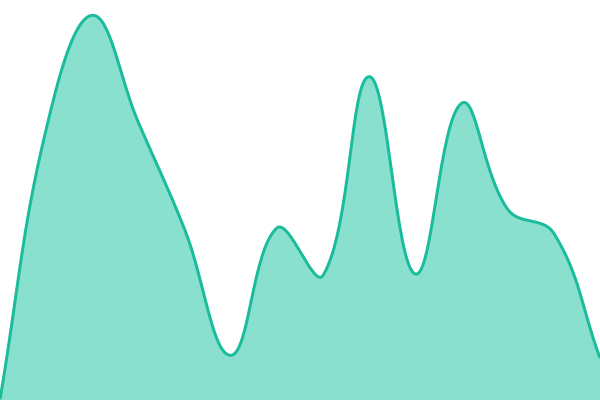 281ms
     
 | 

<a href="https://ponponforever.github.io/status/history/ponpon-forever">84.82%</a>
    

|  [qmo](https://ponponforever.net/qmo) | 🟥 Down | [qmo.yml](https://github.com/ponponforever/status/commits/HEAD/history/qmo.yml) | 

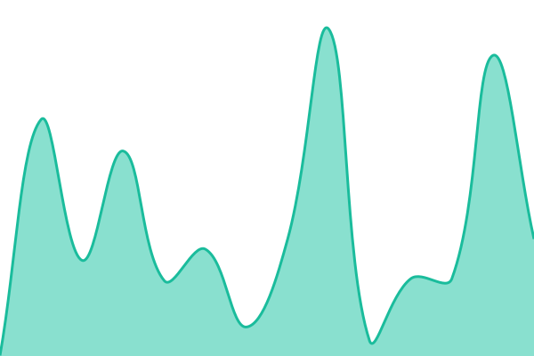 233ms
     
 | 

<a href="https://ponponforever.github.io/status/history/qmo">84.97%</a>
    

|  [Ponpon Diary](https://ponponforever.net/cestlavie) | 🟥 Down | [ponpon-diary.yml](https://github.com/ponponforever/status/commits/HEAD/history/ponpon-diary.yml) | 

 1119ms
     
 | 

<a href="https://ponponforever.github.io/status/history/ponpon-diary">78.75%</a>
    

|  [Yonia in Wonder World](https://ponponforever.net/yoniagu) | 🟥 Down | [yonia-in-wonder-world.yml](https://github.com/ponponforever/status/commits/HEAD/history/yonia-in-wonder-world.yml) | 

 0ms
     
 | 

<a href="https://ponponforever.github.io/status/history/yonia-in-wonder-world">82.17%</a>
    

|  [三寶飯莊](https://ponponforever.net/miao) | 🟥 Down | [signature-combo-cafe.yml](https://github.com/ponponforever/status/commits/HEAD/history/signature-combo-cafe.yml) | 

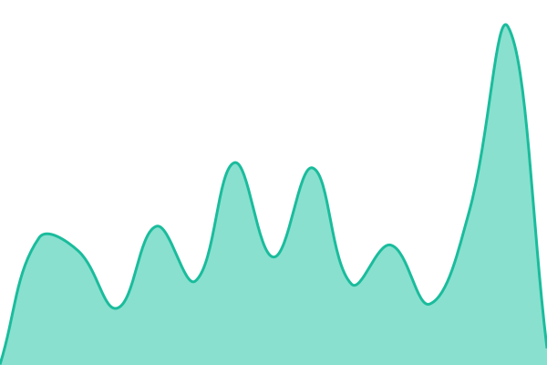 246ms
     
 | 

<a href="https://ponponforever.github.io/status/history/signature-combo-cafe">85.41%</a>
    

|  [小步走。不放棄](https://ponponforever.net/walking) | 🟥 Down | [walking.yml](https://github.com/ponponforever/status/commits/HEAD/history/walking.yml) | 

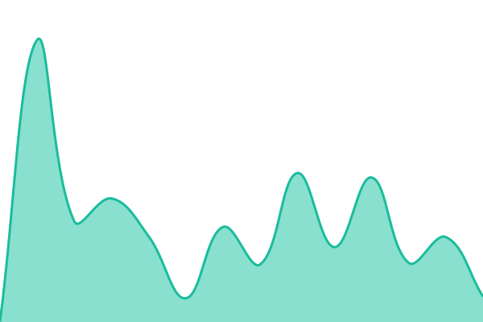 248ms
     
 | 

<a href="https://ponponforever.github.io/status/history/walking">85.56%</a>
    

|  [徐漢珊畫集](https://ponponforever.net/sandymonblog) | 🟥 Down | [sandymon-painting.yml](https://github.com/ponponforever/status/commits/HEAD/history/sandymon-painting.yml) | 

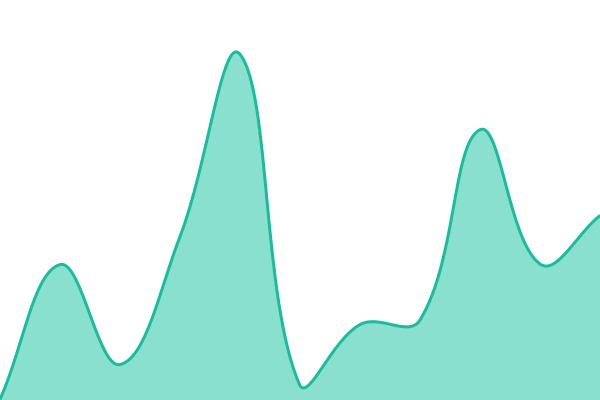 222ms
     
 | 

<a href="https://ponponforever.github.io/status/history/sandymon-painting">85.71%</a>
    

|  [漢珊畫集網誌](https://ponponforever.net/sandymom) | 🟥 Down | [sandymon-blog.yml](https://github.com/ponponforever/status/commits/HEAD/history/sandymon-blog.yml) | 

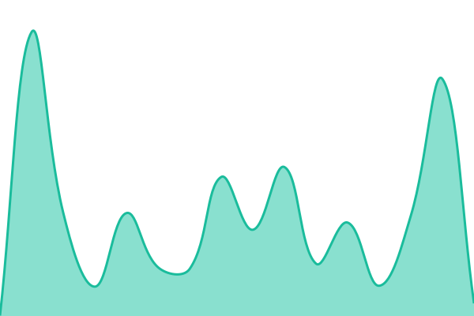 224ms
     
 | 

<a href="https://ponponforever.github.io/status/history/sandymon-blog">79.27%</a>
    

|  [無聊齋2](https://ponponforever.net/boringer2) | 🟥 Down | [boringer2.yml](https://github.com/ponponforever/status/commits/HEAD/history/boringer2.yml) | 

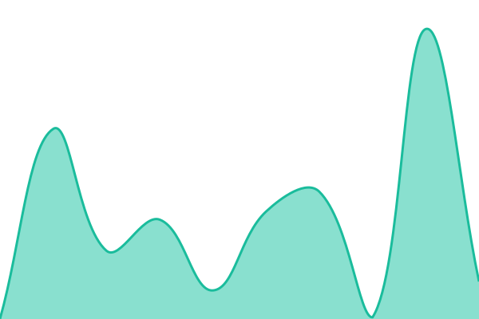 481ms
     
 | 

<a href="https://ponponforever.github.io/status/history/boringer2">79.37%</a>
    

|  [無聊齋主看世界](https://ponponforever.net/benny) | 🟥 Down | [boringer-see-world.yml](https://github.com/ponponforever/status/commits/HEAD/history/boringer-see-world.yml) | 

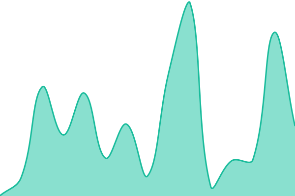 237ms
     
 | 

<a href="https://ponponforever.github.io/status/history/boringer-see-world">79.47%</a>
    

|  [無聊齋日誌](https://ponponforever.net/boringerlog) | 🟥 Down | [boringer-log.yml](https://github.com/ponponforever/status/commits/HEAD/history/boringer-log.yml) | 

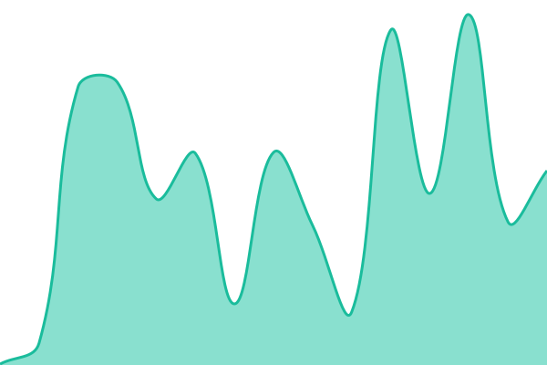 210ms
     
 | 

<a href="https://ponponforever.github.io/status/history/boringer-log">82.89%</a>
    

|  [章志彬的樂活網路電台](https://ponponforever.net/bennyradio) | 🟥 Down | [benny-radio.yml](https://github.com/ponponforever/status/commits/HEAD/history/benny-radio.yml) | 

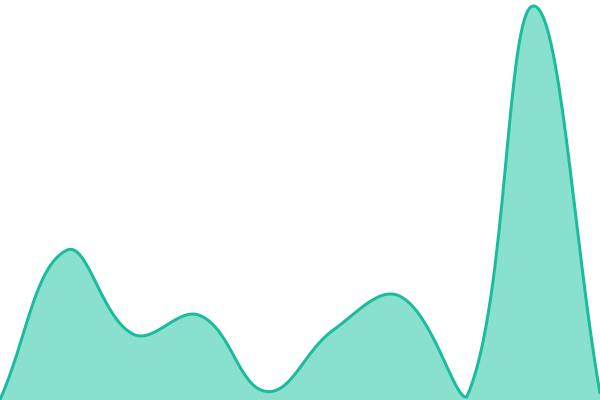 224ms
     
 | 

<a href="https://ponponforever.github.io/status/history/benny-radio">86.45%</a>
    

|  [胖胖廚房筆記](https://ponponforever.net/kitchen) | 🟥 Down | [ponpon-kitchen.yml](https://github.com/ponponforever/status/commits/HEAD/history/ponpon-kitchen.yml) | 

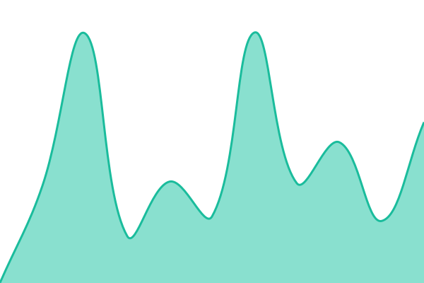 493ms
     
 | 

<a href="https://ponponforever.github.io/status/history/ponpon-kitchen">79.78%</a>
    

|  [永遠的胖胖](https://ponponforever.net/main) | 🟥 Down | [ponpon-forever-main.yml](https://github.com/ponponforever/status/commits/HEAD/history/ponpon-forever-main.yml) | 

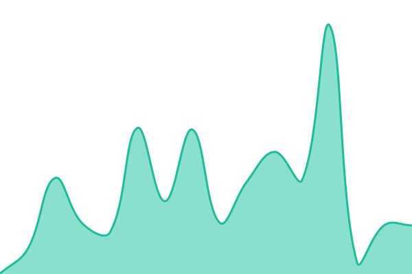 266ms
     
 | 

<a href="https://ponponforever.github.io/status/history/ponpon-forever-main">79.89%</a>
    

|  [詩班通訊應該拒絕無密碼遊客](https://ponponforever.net/cfcchc/) | 🟥 Down | [choir-communications-guest.yml](https://github.com/ponponforever/status/commits/HEAD/history/choir-communications-guest.yml) | 

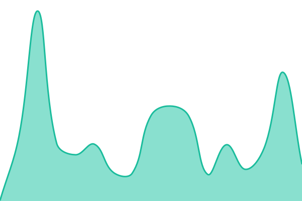 133ms
     
 | 

<a href="https://ponponforever.github.io/status/history/choir-communications-guest">79.99%</a>
    

|  [詩班通訊可用密碼進入](https://ponponforever.net/cfcchc/) | 🟥 Down | [choir-communications-password.yml](https://github.com/ponponforever/status/commits/HEAD/history/choir-communications-password.yml) | 

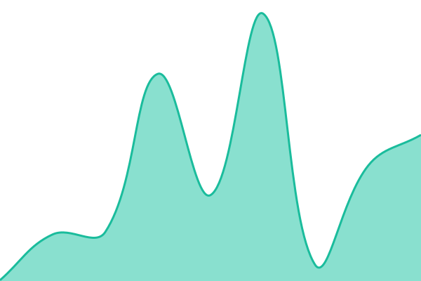 129ms
     
 | 

<a href="https://ponponforever.github.io/status/history/choir-communications-password">80.09%</a>
    

|  [舊金山討論區](https://ponponforever.net/forum) | 🟥 Down | [san-francisco-forum.yml](https://github.com/ponponforever/status/commits/HEAD/history/san-francisco-forum.yml) | 

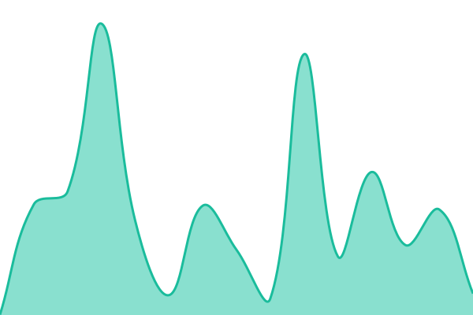 341ms
     
 | 

<a href="https://ponponforever.github.io/status/history/san-francisco-forum">80.20%</a>
    

|  [PONPON & BENNY'S TRAVEL LOG](https://ponponforever.net/travel) | 🟥 Down | [ponpon-and-benny-s-travel-log.yml](https://github.com/ponponforever/status/commits/HEAD/history/ponpon-and-benny-s-travel-log.yml) | 

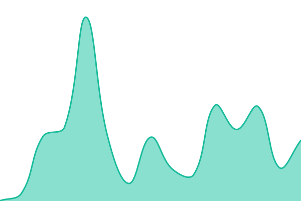 230ms
     
 | 

<a href="https://ponponforever.github.io/status/history/ponpon-and-benny-s-travel-log">80.30%</a>
    

|  [Young Company, The Art of Glass](https://ponponforever.net/samples/youngcom) | 🟥 Down | [young-company-the-art-of-glass.yml](https://github.com/ponponforever/status/commits/HEAD/history/young-company-the-art-of-glass.yml) | 

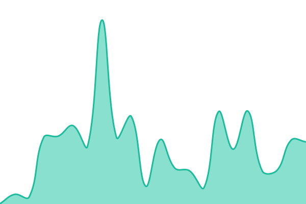 199ms
     
 | 

<a href="https://ponponforever.github.io/status/history/young-company-the-art-of-glass">80.40%</a>
    

|  [三寶飯莊(原)](https://ponponforever.net/3cats) | 🟥 Down | [signature-combo-original.yml](https://github.com/ponponforever/status/commits/HEAD/history/signature-combo-original.yml) | 

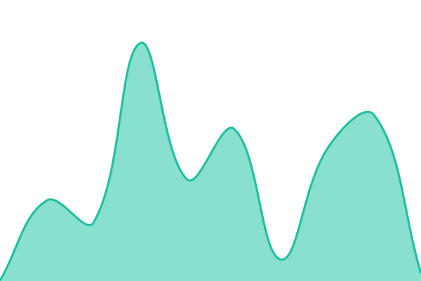 233ms
     
 | 

<a href="https://ponponforever.github.io/status/history/signature-combo-original">80.51%</a>
    

|  [Ponpon's Family](https://ponponforever.net/family) | 🟥 Down | [ponpon-family.yml](https://github.com/ponponforever/status/commits/HEAD/history/ponpon-family.yml) | 

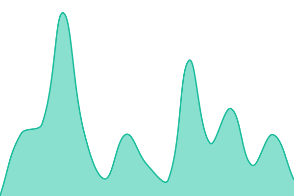 230ms
     
 | 

<a href="https://ponponforever.github.io/status/history/ponpon-family">80.61%</a>
    

|  [貓咪首頁](https://ponponforever.net/cats) | 🟥 Down | [cats.yml](https://github.com/ponponforever/status/commits/HEAD/history/cats.yml) | 

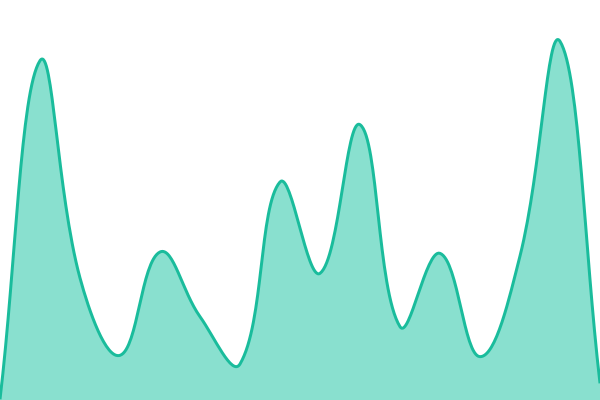 218ms
     
 | 

<a href="https://ponponforever.github.io/status/history/cats">80.71%</a>
    

|  [Young Company, The Art of Glass](https://ponponforever.net/samples/youngcom) | 🟥 Down | [young-company-the-art-of-glass.yml](https://github.com/ponponforever/status/commits/HEAD/history/young-company-the-art-of-glass.yml) | 

 199ms
     
 | 

<a href="https://ponponforever.github.io/status/history/young-company-the-art-of-glass">80.40%</a>
    

<!--end: status pages-->

[**Visit our status website →**](https://demo.upptime.js.org)

## 📄 License

- Powered by: [Upptime](https://github.com/upptime/upptime)
- Code: [MIT](./LICENSE) © [Anand Chowdhary](https://anandchowdhary.com), supported by [Pabio](https://pabio.com)
- Data in the `./history` directory: [Open Database License](https://opendatacommons.org/licenses/odbl/1-0/)
